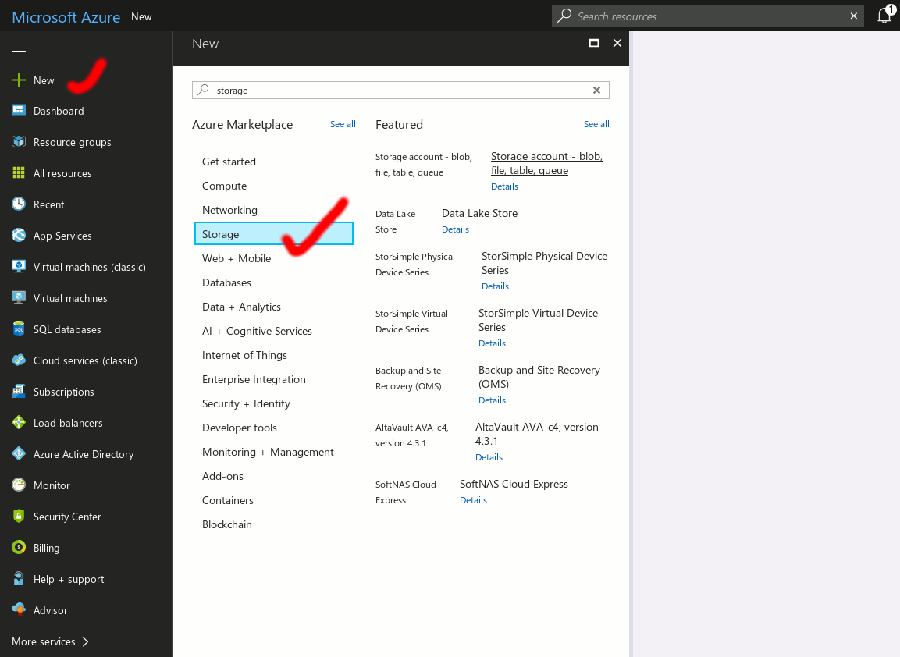
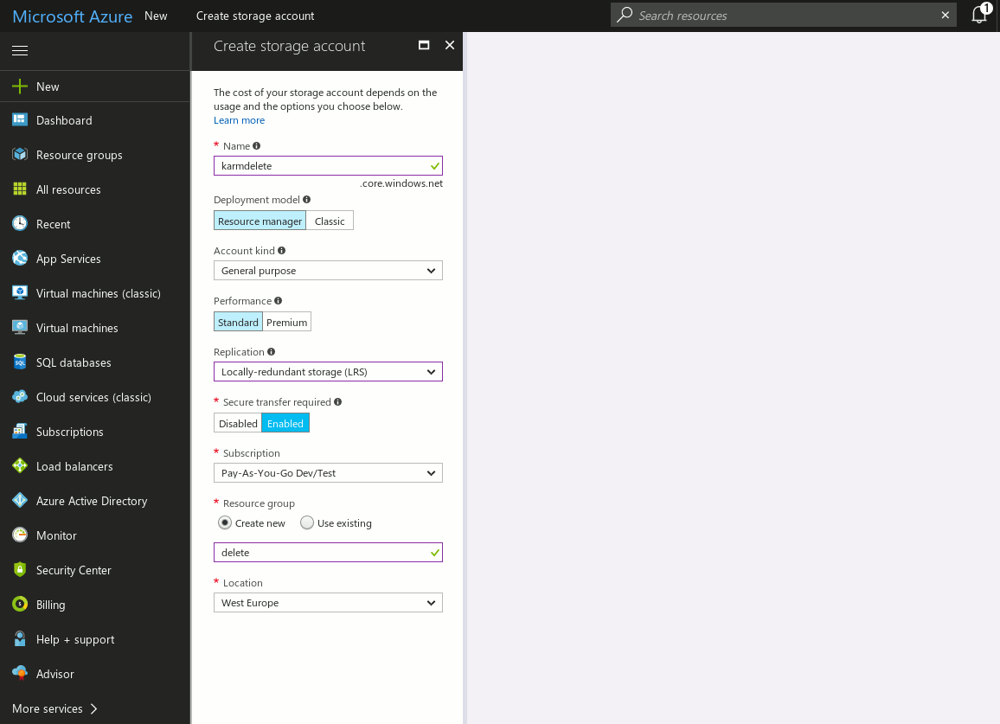
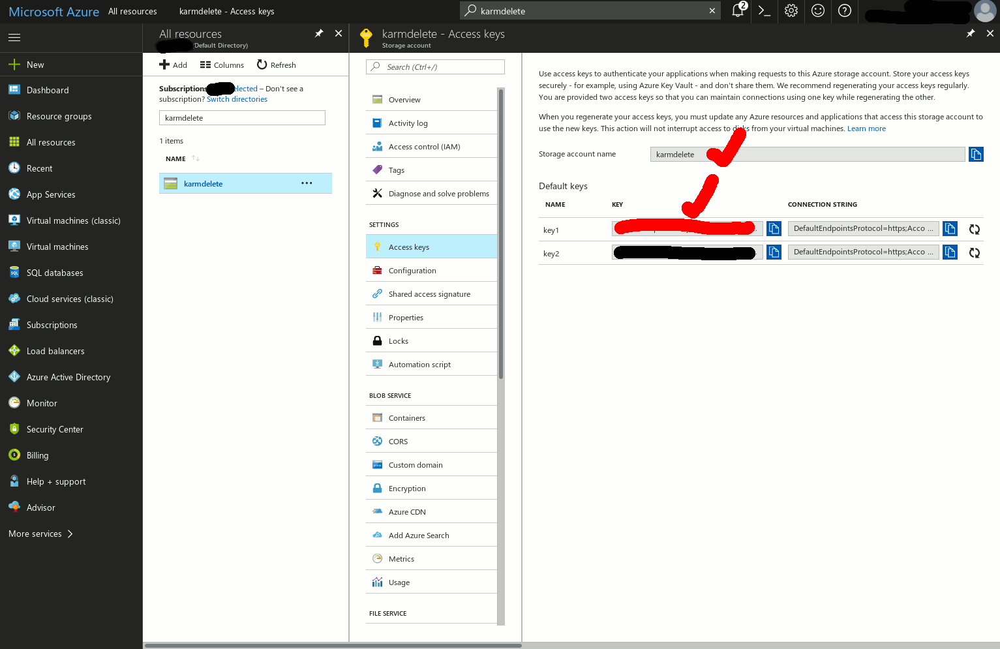
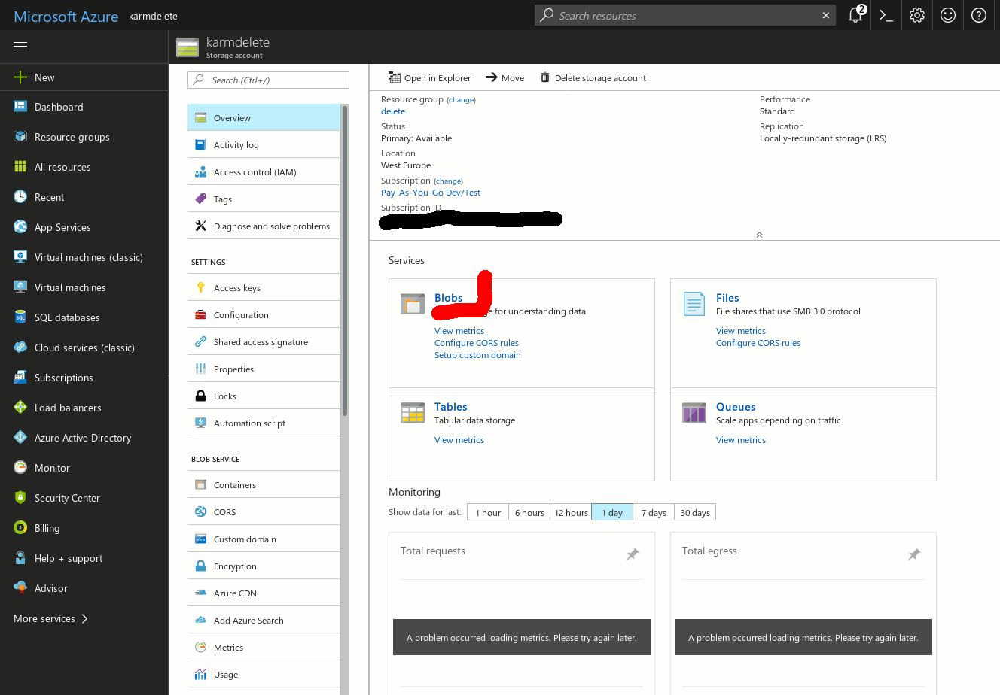
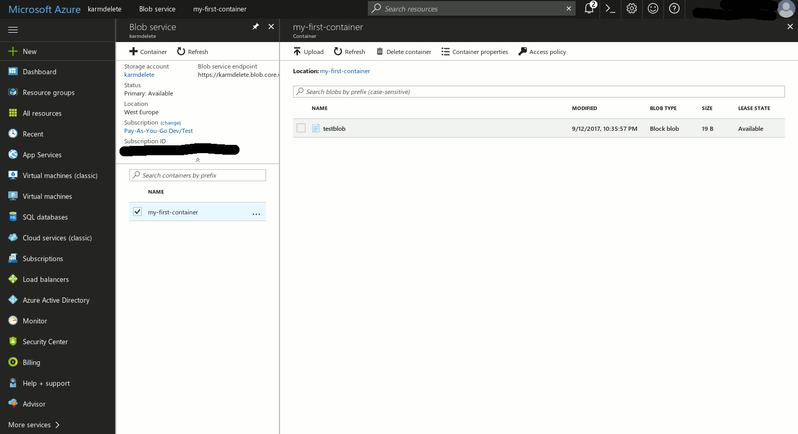

# About
Storing and reading BLOBs to and from a cloud service. The project will consist of a library, command line tool, Apache HTTP Server module and an Nginx module. Currently, the command line tool is work in progress.

# Building
 * cmake
 * APR, APR Util
 * cURL
 * OpenSSL

# Releases and Downloads
See [Releases](https://github.com/Karm/mod_cloud_storage/releases)

# Usage
The command line tool is controlled via env variables and command line arguments. Command line arguments take priority and overwrite env variables settings. If the action is set to *WRITE_BLOB* and neither *MCS_PATH_TO_FILE* nor *--path_to_file* is specified, the command line tool tries to read from stdin. Similarly, when then action is set to *READ_BLOB*, and neither *MCS_PATH_TO_FILE* nor *--path_to_file* is specified, the command line tool writes the blob contents to stdout.

## Env variables
```
MCS_ACTION=READ_BLOB|WRITE_BLOB|LIST_BLOBS|CREATE_CONTAINER
MCS_AZURE_STORAGE_KEY=Eby8vdM02xNOcqFlqUwJPLlmEtlCDXJ1OUzFT50uSRZ6IFsuFq2UVErCz4I6tq/K1SZFPTOtr/KBHBeksoGMGw==
MCS_AZURE_STORAGE_ACCOUNT=devstoreaccount1
MCS_AZURE_BLOB_NAME=test
MCS_AZURE_CONTAINER=your-container
MCS_PATH_TO_FILE=/tmp/meh
MCS_BLOB_STORE_URL=127.0.0.1:10000
MCS_TEST_REGIME=true|false
```

## Command line arguments
```
--action
--azure_storage_key
--azure_storage_account
--blob_name
--azure_container
--path_to_file
--blob_store_url
--test_regime
```

## Testing and fooling around
 * On Linux, get your [Azurite docker container](https://github.com/arafato/azurite#docker-image) up and running
 * On Windows, install [Azure Storage Emulator](https://docs.microsoft.com/en-us/azure/storage/common/storage-use-emulator?toc=%2fazure%2fstorage%2fqueues%2ftoc.json)
 * Use either *--test_regime true* parameter or *MCS_TEST_REGIME=true* env var as depicted in the examples below

### Creating a container
 ```
./mod_cloud_storage \
--action CREATE_CONTAINER \
--azure_storage_key Eby8vdM02xNOcqFlqUwJPLlmEtlCDXJ1OUzFT50uSRZ6IFsuFq2UVErCz4I6tq/K1SZFPTOtr/KBHBeksoGMGw== \
--azure_storage_account devstoreaccount1 \
--azure_container my-first-container \
--blob_store_url 127.0.0.1:10000 \
--test_regime true
```
Note the storage account is always called devstoreaccount1 by definition in all Azure Storage emulator implementations. The same holds for the storage key. Container and blob names are arbitrary.

### Writing a BLOB to the container
 * Let's create a test file, e.g. ```echo "Silence is golden." > /tmp/test```
```
./mod_cloud_storage \
--action WRITE_BLOB \
--azure_storage_key 'Eby8vdM02xNOcqFlqUwJPLlmEtlCDXJ1OUzFT50uSRZ6IFsuFq2UVErCz4I6tq/K1SZFPTOtr/KBHBeksoGMGw==' \
--azure_storage_account 'devstoreaccount1' \
--azure_container mod-cloud-storage \
--blob_store_url localhost:10000 \
--test_regime true \
--blob_name 'testblob' < /tmp/test
```
Output (DEBUG):
```
Reading from stdin
BLOB to be uploaded length: 19
BLOB to be uploaded MD5sum base64: YmT6qz9/oJawL1eym/1EQQ==
BLOB to be uploaded MD5sum hex:    6264faab3f7fa096b02f57b29bfd4441
 libcurl said: No error
Response Code: 201
Response Body followed by \n:(null)
```
Note the tool is reading from stdin via pipe now *...< /tmp/test*. One could use either *MCS_PATH_TO_FILE* env var or *--path_to_file* parameter instead. If all aforementioned is specified, *parameter* takes precedence over *env var* and env var takes precedence over *stdin*.

# Reading the BLOB from the container
```
./mod_cloud_storage \
--action READ_BLOB \
--azure_storage_key 'Eby8vdM02xNOcqFlqUwJPLlm\EtlCDXJ1OUzFT50uSRZ6IFsuFq2UVErCz4I6tq/\K1SZFPTOtr/KBHBeksoGMGw==' \
--azure_storage_account 'devstoreaccount1' \
--azure_container mod-cloud-storage \
--blob_store_url localhost:10000 \
--test_regime true \
--blob_name 'testblob'
```
Neither *MCS_PATH_TO_FILE* nor *--path_to_file* was specified, so the content of the BLOB was written to stdout. Output (DEBUG):
```
 libcurl said: No error
Response Code: 200
Response Body followed by \n:Silence is golden.
```
Note that if a path to the file is specified, the content of the file is **overwritten**, not appended to.

## Working with a real Azure storage
 * [Create your Azure profile](https://azure.microsoft.com/en-us/free/) if you don't have one.
 * Create a Storage account if you don't have one, Name, Resource group, all arbitrary. If you need help with this terminology, read [Azure Storage manual](https://docs.microsoft.com/en-us/azure/storage/common/storage-introduction). In this example, we use new Storage account **karmdelete**.<br>
   <a href="docs/img/00-new-storage.gif" target="blank"></a>
   <a href="docs/img/01-new-storage-arbitrary-name.gif" target="blank"></a><br>
 * Copy your **Account name** and one of the two **Storage keys**.<br>
   <a href="docs/img/02-copy-account-name-and-one-of-storage-keys.gif" target="blank"></a><br>
 * You are ready to use the command line tool now. First, create a container called, e.g. **my-first-container**.
    ```
    ./mod_cloud_storage \
    --action CREATE_CONTAINER \
    --azure_storage_key 'YourStorageKey' \
    --azure_storage_account karmdelete \
    --azure_container my-first-container
    ```
 * Let's create a test file, e.g. ```echo "Silence is golden." > /tmp/test```
 * Upload the file as a BLOB called e.g. **testblob** to your container **my-first-container** within your Storage account **karmdelete**.
    ```
    ./mod_cloud_storage \
    --action WRITE_BLOB \
    --azure_storage_key 'YourStorageKey' \
    --azure_storage_account karmdelete \
    --azure_container my-first-container \
    --blob_name 'testblob' \
    --path_to_file /tmp/test
    ```
    Output (DEBUG):
    ```
    Reading from file.
    BLOB to be uploaded length: 19
    BLOB to be uploaded MD5sum base64: YmT6qz9/oJawL1eym/1EQQ==
    BLOB to be uploaded MD5sum hex:    6264faab3f7fa096b02f57b29bfd4441
     libcurl said: No error
    Response Code: 201
    Response Body followed by \n:(null)
    ```
 * One may check the result on Azure Portal, click on Blobs in your Storage account:<br>
   <a href="docs/img/03-click-on-blobs.gif" target="blank"></a>
   <a href="docs/img/04-testblob-in-container-created.gif" target="blank"></a><br>
 * If you download the blob, it contains 19 bytes "Silence is golden.\n"
 * Let's read the contents of the BLOB with *READ_BLOB* action:
    ```
    ./mod_cloud_storage \
    --action READ_BLOB \
    --azure_storage_key 'YourStorageKey' \
    --azure_storage_account karmdelete \
    --azure_container my-first-container \
    --blob_name 'testblob' \
    --path_to_file /tmp/test_out
    ```
    Output (DEBUG):
    ```
     libcurl said: No error
    Response Code: 200
    Writing to file: /tmp/test_out
    19 bytes of response written to /tmp/test_out.
    ```
 * **Do not use a storage account with valuable containers in it. This tool is just a toy.**
